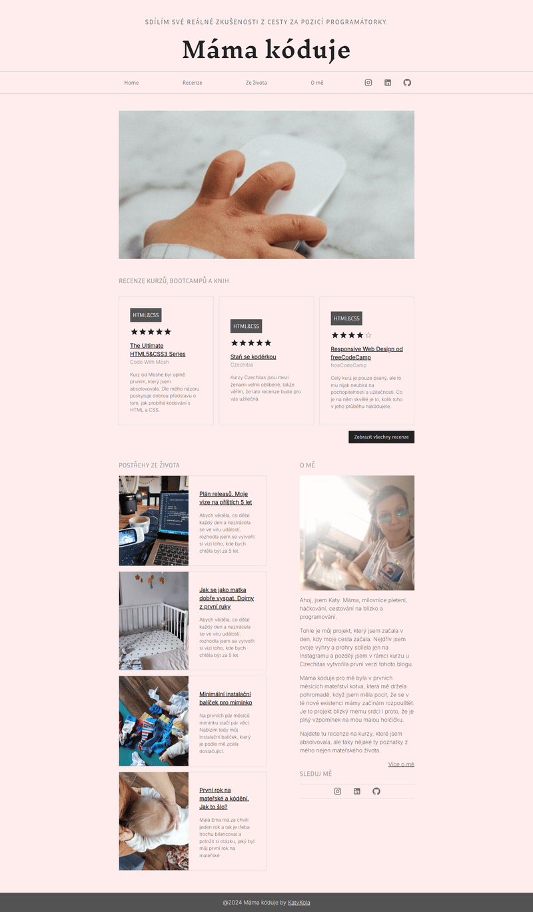

# My Blog

This blog is a personal journey of mine as a self-taught developer and mother. It chronicles my path to becoming a developer during maternity leave, sharing the challenges, triumphs, and lessons learned along the way. Through detailed course reviews, a timeline of my learning process, and insights into balancing motherhood with career development, I aim to inspire others who are on similar journeys. The blog also includes my life plans, growth as a developer, and reflections on how I’ve managed to pursue my passion while raising a family.

## Technologies Used

Here are the main technologies and tools I use to build and manage the blog:

### Frontend

- **React**: The blog's frontend is built using React.

- **Vite**: I use Vite as the build tool for the project. 

### Backend & Database

- **Firebase Firestore**: For managing user data, blog content, and course details, I use Firebase Firestore.

- **Firebase Authentication**: User sign-ups, logins, and password resets are handled through Firebase Authentication.

### Image Storage & Management

- **Cloudinary**: I use Cloudinary for image storage, management, and optimization.

### Styling

- **Material-UI (MUI)**: For consistent and modern design.

- **useTheme**: To ensure a consistent theme across the blog, I leverage MUI's useTheme hook.

### Responsive Design

- **Mobile-First Approach**: The blog is designed to be fully responsive, with a focus on mobile-first design. It automatically adjusts to provide an optimal viewing experience on desktops, tablets, and smartphones.

## Features

- **Course Reviews**: Detailed reviews of various programming and web development courses.
- **Blog Posts**: Insightful posts on industry trends, development tips, and tutorials.
- **User Authentication**: Secure user sign-ups and logins with Firebase Authentication.
- **Dynamic Content**: Real-time updates and content management using Firebase Firestore.

